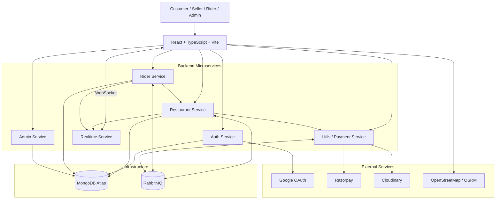
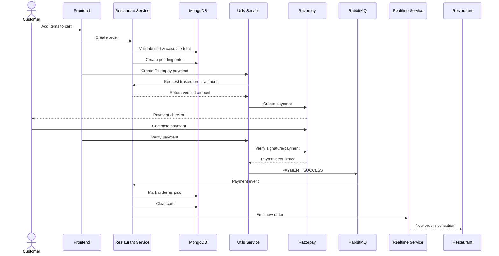
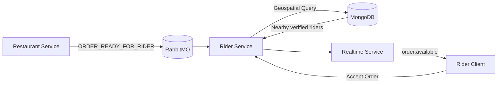

# 🍽️ CraveMate

### Full-Stack Food Delivery Platform with Microservices & Real-Time Tracking

[](https://cravemate-client.onrender.com)


---

## 📌 About

**CraveMate** is a full-stack food delivery platform built using a **microservice-based architecture**.

It supports the complete food delivery lifecycle:

**Customer → Restaurant → Payment → Order Processing → Rider Assignment → Real-Time Delivery Tracking**

The system uses **REST APIs** for synchronous communication, **RabbitMQ** for asynchronous event-driven workflows, and **Socket.IO** for real-time updates and rider tracking.

---

## ✨ Features

### 👤 Customer
- Google OAuth and Email/Password authentication
- Restaurant discovery based on location
- Restaurant search
- Menu browsing
- Cart management
- Saved delivery addresses
- Razorpay payments
- Order history
- Real-time order status
- Live rider location tracking

### 🏪 Restaurant
- Restaurant registration
- Admin verification
- Restaurant profile management
- Menu management
- Open/close restaurant
- Incoming order management
- Order status updates
- Real-time new order notifications

### 🛵 Rider
- Rider registration and verification
- Online/offline availability
- Nearby delivery request discovery
- Order acceptance
- Pickup and delivery workflow
- Live location sharing
- Current delivery tracking

### 🛡️ Admin
- Restaurant verification
- Rider verification
- Protected admin dashboard
- Marketplace onboarding management

---

# 🏗️ Architecture

CraveMate follows a **microservices architecture** where each backend service has a specific responsibility and can be deployed independently.



---

## 🔄 Order Flow



---

## 🛵 Rider Dispatch Flow



---

# ⚡ Real-Time Tracking

Socket.IO is used for:

- New order notifications
- Order status updates
- Rider assignment
- Delivery requests
- Rider location updates

```text
Rider Device
     ↓
Rider Service
     ↓
Realtime Service
     ↓
Socket.IO
     ↓
Customer
```

---

# 💳 Payment Flow

CraveMate currently uses **Razorpay** for online payments.

```text
Customer
    ↓
Frontend
    ↓
Restaurant Service
    ↓
Utils / Payment Service
    ↓
Razorpay
    ↓
Payment Verification
    ↓
RabbitMQ
    ↓
Restaurant Service
    ↓
Order marked as PAID
```

Payment amount is calculated and verified on the backend rather than trusting the frontend.

---

# 📍 Location-Based Features

CraveMate uses MongoDB geospatial functionality for location-aware operations.

### Restaurant Discovery

Customers can discover nearby restaurants using:

- GeoJSON coordinates
- `2dsphere` indexes
- MongoDB geospatial queries

### Rider Discovery

When an order is ready, the Rider service searches for:

```text
Verified
+
Available
+
Nearby
```

delivery partners.

---

# 🛠️ Tech Stack

| Technology | Purpose |
|---|---|
| React | Frontend UI |
| TypeScript | Type safety and maintainability |
| Vite | Frontend build tool |
| Tailwind CSS | UI styling |
| Node.js | Backend runtime |
| Express.js | REST APIs |
| MongoDB Atlas | Primary database |
| Mongoose | MongoDB ODM |
| RabbitMQ | Event-driven communication |
| Socket.IO | Real-time communication |
| JWT | Authentication & authorization |
| Google OAuth | Social authentication |
| bcrypt | Password hashing |
| Razorpay | Online payments |
| Cloudinary | Image storage |
| Leaflet / OpenStreetMap | Maps & location visualization |
| OSRM | Route calculation |
| Docker | Containerization |
| Render | Deployment |

---

# 📂 Project Structure

```text
CraveMate/
│
├── frontend/
│
├── services/
│   ├── auth/
│   ├── restaurant/
│   ├── utils/
│   ├── realtime/
│   ├── rider/
│   └── admin/
│
├── README.md
└── .gitignore
```

---

# 🔐 Security

CraveMate implements:

- JWT authentication
- Google OAuth
- bcrypt password hashing
- Role-based authorization
- Protected admin/seller/rider routes
- Server-side payment verification
- Internal service authentication
- Restaurant ownership validation
- Rider authorization
- Server-side order state validation
- Environment-based secret management

Sensitive credentials such as:

```text
MongoDB credentials
Razorpay secrets
Google client secret
Cloudinary secret
JWT secret
Internal service key
```

are kept in environment variables and are not exposed to the frontend.

---

# 🚀 Local Setup

## 1. Clone

```bash
git clone https://github.com/<your-username>/CraveMate.git
cd CraveMate
```

## 2. Install dependencies

```bash
cd frontend
npm install
```

Install dependencies for each backend service:

```bash
cd services/auth
npm install

cd ../restaurant
npm install

cd ../utils
npm install

cd ../realtime
npm install

cd ../rider
npm install

cd ../admin
npm install
```

## 3. Configure Environment Variables

Create `.env` files using the provided `.env.example` files.

Required infrastructure:

- MongoDB Atlas
- RabbitMQ / CloudAMQP
- Google OAuth credentials
- Razorpay credentials
- Cloudinary credentials

## 4. Start Services

Run each service in a separate terminal.

```bash
npm run dev
```

Frontend:

```bash
cd frontend
npm run dev
```

---

# 🌐 Live Demo

### [🚀 Open CraveMate](https://cravemate-client.onrender.com)

> Free Render services may take some time to wake up after inactivity.

---

# 🎯 Key Engineering Highlights

- Microservice-based backend architecture
- Event-driven communication using RabbitMQ
- Real-time communication with Socket.IO
- Location-based restaurant and rider discovery
- MongoDB geospatial queries
- Atomic rider assignment workflow
- Secure Razorpay payment verification
- JWT + Google OAuth + Email/Password authentication
- Cloudinary-based image management
- Dockerized backend services
- Independently deployable services

---

# 🔮 Future Improvements

- Redis caching
- Payment webhooks
- Notification service
- Coupon and discount system
- Ratings and reviews
- Advanced admin analytics
- Dead-letter queues and retry mechanisms
- Centralized logging
- Automated testing
- CI/CD pipeline
- Redis adapter for horizontally scaled Socket.IO

---

<div align="center">

### 🍽️ CraveMate

**Your cravings. Delivered.**

[🌐 Live Demo](https://cravemate-client.onrender.com)

</div>
