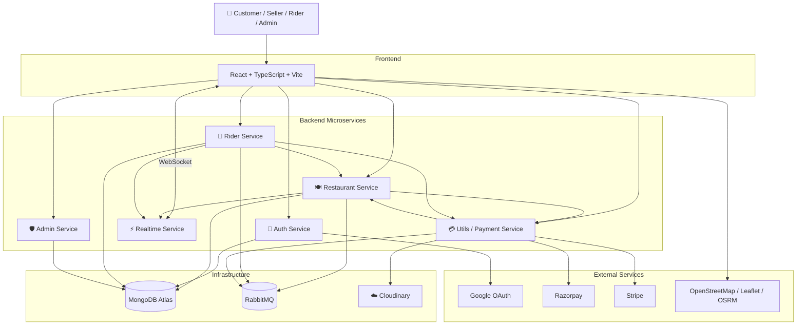
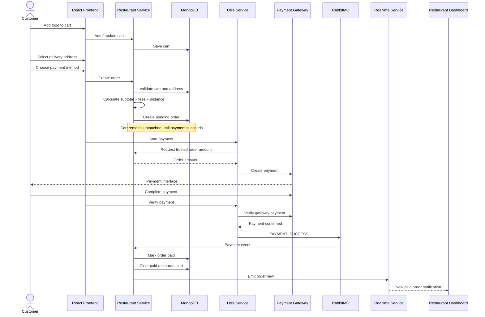
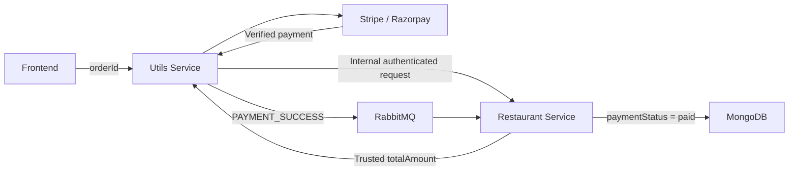
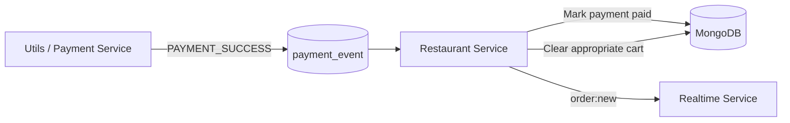
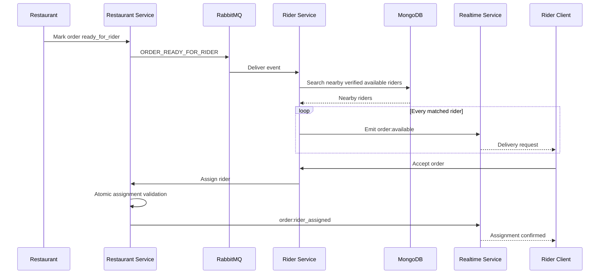
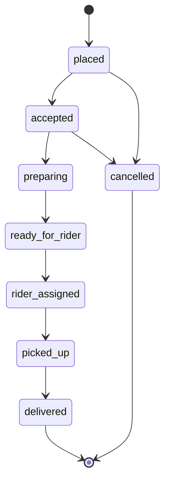
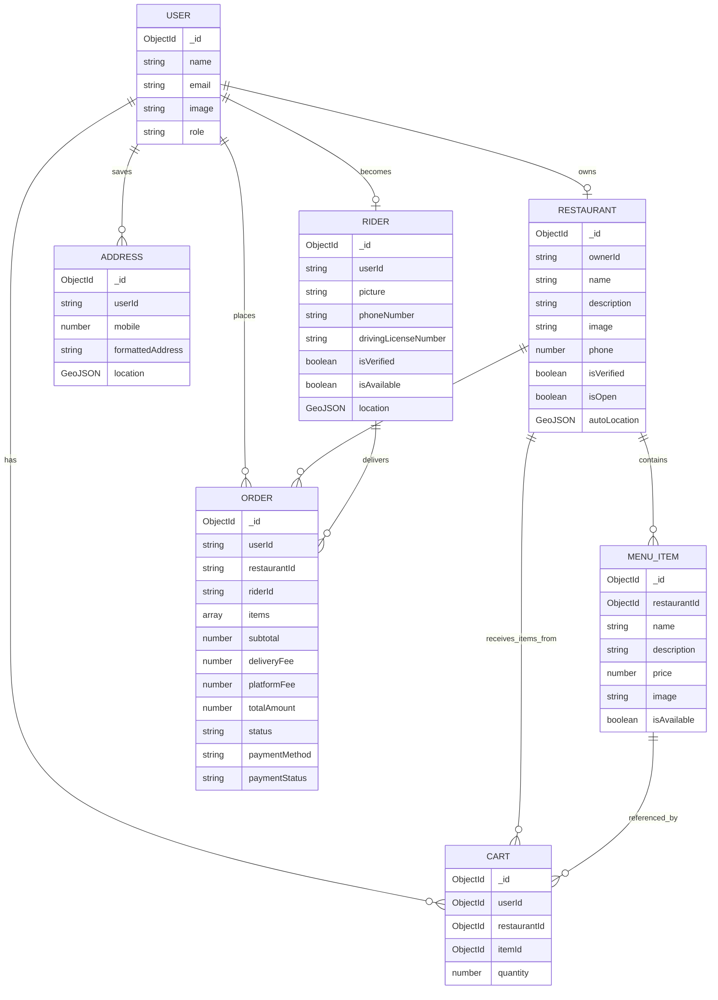
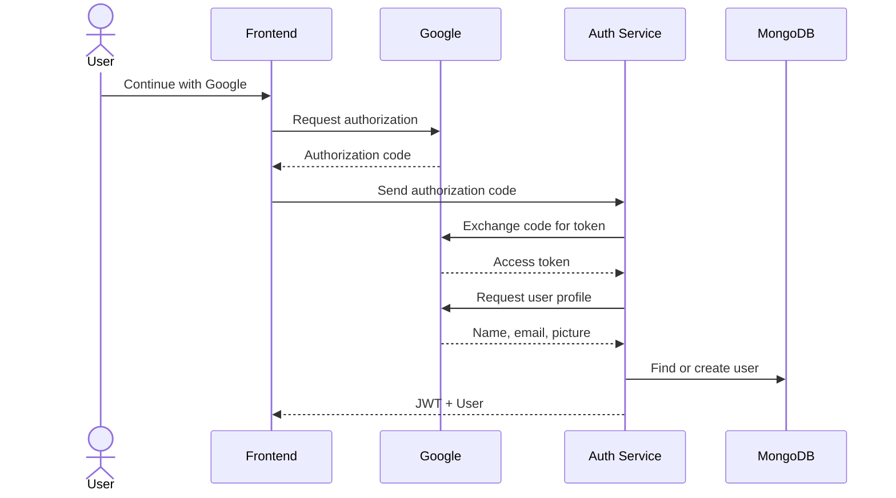
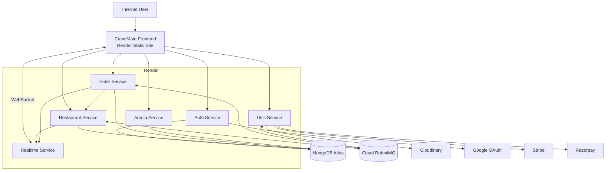
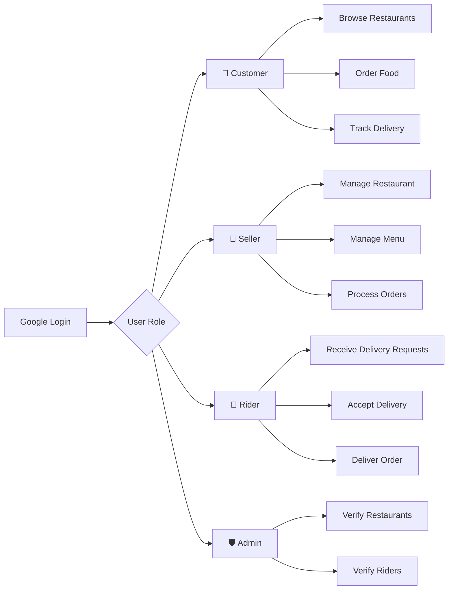

<div align="center">

# 🍽️ CraveMate

### Full-Stack Food Delivery & Real-Time Delivery Management Platform

A production-style food delivery marketplace built using a **microservice architecture**, supporting customers, restaurants, delivery partners, administrators, real-time order tracking, event-driven communication, and multiple payment gateways.

[](https://cravemate-client.onrender.com)

<br/>


</div>

---

## 📌 Overview

**CraveMate** is a full-stack food delivery application designed around a distributed **microservice architecture**.

Unlike a basic food-ordering CRUD application, CraveMate models the complete lifecycle of a real food-delivery platform:

- Customer authentication
- Restaurant discovery
- Menu browsing
- Cart management
- Address management
- Order creation
- Online payment
- Restaurant order processing
- Delivery-partner discovery
- Rider assignment
- Live order status updates
- Real-time rider location tracking
- Restaurant verification
- Rider verification
- Role-based access control

The system combines synchronous REST APIs with asynchronous messaging using **RabbitMQ** and real-time communication using **Socket.IO**.

---

# 🌐 Live Application

### 🔗 Live Demo

**https://cravemate-client.onrender.com**

> The backend is deployed as multiple independent services.  
> If free-tier Render instances are sleeping, the first request may take a little longer while the services wake up.

---

# ✨ Major Features

## 👤 Customer Features

Customers can use CraveMate to discover nearby restaurants and complete the entire food-ordering journey.

### Authentication

- Google OAuth 2.0 login
- JWT-based authentication
- Persistent authenticated sessions
- Protected application routes
- One-time account role selection
- Customer, seller and rider roles

### Restaurant Discovery

- Browser geolocation support
- Nearby restaurant discovery
- MongoDB geospatial queries
- Restaurant search by name
- Distance-based sorting
- Verified restaurants only
- Open/closed restaurant status
- Restaurant detail pages

### Menu Browsing

- Browse restaurant menu
- Menu item image
- Item description
- Dynamic pricing
- Availability status
- Restaurant-specific menu

### Shopping Cart

- Add food items to cart
- Increase quantity
- Decrease quantity
- Remove items
- Clear cart
- Single-restaurant cart validation
- Stale-item protection
- Availability revalidation before checkout
- Quantity validation

### Delivery Address

- Save delivery addresses
- Browser location detection
- Interactive map interface
- Latitude/longitude storage
- GeoJSON location storage
- Reverse-geocoded formatted address
- Mobile number validation
- Multiple saved addresses
- Delete saved address

### Checkout

- Server-side price calculation
- Delivery fee calculation
- Platform fee calculation
- Distance calculation between restaurant and customer
- Pending order generation
- 15-minute pending-order expiration
- Cart preserved when payment is cancelled or fails

### Payments

Supports two independent payment gateways:

#### Razorpay

- Razorpay order generation
- Payment signature verification
- Razorpay payment validation
- Captured-payment verification
- Order/payment relationship validation

#### Stripe

- Stripe Checkout Session
- Card payments
- Server-side Stripe verification
- Payment status validation
- Checkout success handling

### Orders

- View previous orders
- View detailed order information
- Real-time order status
- Restaurant status updates
- Rider assignment information
- Rider contact information
- Live delivery tracking

---

# 🏪 Restaurant / Seller Features

Restaurant owners receive an independent seller experience.

### Restaurant Onboarding

- Restaurant creation
- Restaurant image upload
- Name and description
- Contact phone number
- Automatic geolocation
- Formatted restaurant address
- One restaurant per seller account

### Restaurant Verification

New restaurants are initially created as:

```text
isVerified = false
```

An administrator must verify the restaurant before it can begin accepting orders.

A restaurant cannot be opened before verification.

### Restaurant Management

Restaurant owners can:

- Edit restaurant information
- Change restaurant description
- Open restaurant
- Close restaurant
- View verification state
- View restaurant profile

### Menu Management

Restaurant owners can:

- Add menu items
- Upload menu item images
- Set item price
- Set description
- Enable/disable items
- Delete menu items

Images are uploaded through the dedicated utility service and stored using **Cloudinary**.

### Order Management

Restaurants receive paid orders and manage them through a controlled order lifecycle:

```text
Placed
   ↓
Accepted
   ↓
Preparing
   ↓
Ready for Rider
```

Invalid state transitions are rejected by the server.

### Seller Dashboard

Restaurant owners can monitor:

- Active orders
- Delivered orders
- Revenue from completed food orders
- Incoming orders
- Order progress
- Rider assignment

### Real-Time Notifications

New paid orders are pushed to restaurant clients using:

```text
Socket.IO
```

The restaurant dashboard can react immediately without continuously polling the API.

---

# 🛵 Delivery Partner Features

CraveMate contains a dedicated delivery workflow rather than treating delivery as a simple order field.

## Rider Onboarding

Delivery partners can create rider profiles containing:

- Profile image
- Phone number
- Government identification details
- Driving license details
- Current location

New riders start as:

```text
isVerified = false
```

They cannot become available for deliveries until an administrator verifies them.

---

## Rider Availability

Verified delivery partners can switch between:

```text
ONLINE
```

and

```text
OFFLINE
```

When going online, their latest geolocation is stored in MongoDB as a GeoJSON point.

---

## Nearby Rider Discovery

When an order becomes ready:

```text
Restaurant
      ↓
ORDER_READY_FOR_RIDER event
      ↓
RabbitMQ
      ↓
Rider Service
      ↓
MongoDB Geospatial Query
      ↓
Nearby Available Riders
```

The Rider service searches for:

- Verified riders
- Available riders
- Riders geographically close to the restaurant

Matching riders receive the delivery request through Socket.IO.

---

## Atomic Rider Assignment

CraveMate prevents two delivery partners from taking the same delivery.

The assignment operation verifies:

- Order exists
- Order has been paid
- Order is ready for rider
- Order does not already have a rider
- Rider does not already have an active order

The database update is performed conditionally so the first valid rider gets the order.

Other riders receive an:

```text
Order already taken
```

response.

---

## Delivery Workflow

After rider assignment:

```text
Ready for Rider
      ↓
Rider Assigned
      ↓
Picked Up
      ↓
Delivered
```

Only valid transitions are accepted.

---

## Rider Delivery Dashboard

Delivery partners can access:

- Current delivery
- Restaurant information
- Customer delivery location
- Customer phone number
- Delivery distance
- Delivery earnings
- Interactive route map
- Pickup action
- Delivered action

---

# 📍 Real-Time Rider Tracking

During an active delivery, the rider periodically sends location updates.

The location update is authenticated by the Rider service before being forwarded to the realtime service.

```text
Rider Browser
      │
      │ latitude / longitude
      ▼
Rider Service
      │
      │ Verify JWT
      │ Verify rider
      │ Verify assigned order
      ▼
Realtime Service
      │
      │ Socket.IO
      ▼
Customer Room
      │
      ▼
Customer Live Map
```

Customers therefore receive live rider coordinates through:

```text
rider:location
```

events.

---

# 🛡️ Administrator Features

CraveMate includes a dedicated Admin service.

Administrators can:

- View pending restaurants
- View pending riders
- Verify restaurants
- Verify delivery partners
- Access protected admin APIs
- Manage marketplace onboarding

Admin endpoints require:

```text
Authenticated User
        +
Admin Role
```

before verification actions are permitted.

---

# 🏗️ System Architecture

CraveMate uses multiple independently deployable backend services.



---

# 🧩 Microservices

| Service | Responsibility | Local Port |
|---|---|---:|
| **Frontend** | Customer, restaurant, rider and admin UI | `5173` |
| **Auth Service** | Google OAuth, JWT, users and roles | `5000` |
| **Restaurant Service** | Restaurants, menus, cart, addresses and orders | `5001` |
| **Utils Service** | Payments, Cloudinary and payment events | `5002` |
| **Realtime Service** | Socket.IO communication | `5004` |
| **Rider Service** | Rider profiles, matching and delivery workflow | `5005` |
| **Admin Service** | Restaurant and rider verification | `5006` |

Each backend service is independently deployable and contains its own:

```text
package.json
tsconfig.json
Dockerfile
.env.example
src/
```

---

# 🔄 Customer Order Data Flow

The complete ordering process is:



---

# 💳 Payment Architecture

Payments are intentionally separated from the main Restaurant service.



This design prevents the browser from deciding the final payment amount.

The payment service fetches the trusted amount directly from the Restaurant service.

---

# ✅ Payment Reliability

CraveMate contains multiple safeguards around checkout.

## Cart Protection

The cart is **not cleared when an order is created**.

Instead:

```text
Create Order
     ↓
Payment Pending
     ↓
Payment Verified
     ↓
RabbitMQ PAYMENT_SUCCESS
     ↓
Order marked Paid
     ↓
Cart cleared
```

Therefore, cancelling or failing checkout does not automatically destroy the customer's basket.

---

## Razorpay Verification

Razorpay verification checks:

- Payment signature
- Razorpay order
- Razorpay payment
- Order receipt
- Gateway order/payment relationship
- Captured payment status

---

## Stripe Verification

Stripe checkout is accepted only after:

```text
payment_status === "paid"
```

The order ID is stored inside Stripe session metadata and recovered during verification.

---

# 🐇 Event-Driven Architecture

RabbitMQ is used for asynchronous communication between services.

Two major application events are:

```text
PAYMENT_SUCCESS
ORDER_READY_FOR_RIDER
```

---

## Payment Event Flow



---

## Rider Dispatch Event Flow



---

# ⚡ Real-Time Architecture

CraveMate uses **Socket.IO** for real-time functionality.

Socket connections are authenticated using the same JWT authentication system used by the REST services.

After authentication, users join private Socket.IO rooms.

Example:

```text
user:<USER_ID>
```

Restaurants can also join:

```text
restaurant:<RESTAURANT_ID>
```

Important realtime events include:

| Event | Purpose |
|---|---|
| `order:new` | Notify restaurant about new paid order |
| `order:update` | Notify customer/restaurant about status change |
| `order:available` | Notify matching riders about delivery |
| `order:rider_assigned` | Notify interested clients about assigned rider |
| `rider:location` | Stream rider coordinates to customer |

---

# 📦 Order State Machine

CraveMate enforces server-side order-state transitions.



### Restaurant-controlled states

```text
placed
   ↓
accepted
   ↓
preparing
   ↓
ready_for_rider
```

### Rider-controlled states

```text
rider_assigned
      ↓
picked_up
      ↓
delivered
```

This prevents clients from arbitrarily jumping between order states.

---

# 🗺️ Location & Geospatial Architecture

MongoDB GeoJSON is used for location-aware features.

Restaurant locations are stored as:

```json
{
  "type": "Point",
  "coordinates": [
    "longitude",
    "latitude"
  ]
}
```

The same structure is used for riders and customer delivery locations.

---

## Nearby Restaurant Search

The Restaurant service uses MongoDB:

```text
$geoNear
```

to discover restaurants near the customer.

The query considers:

- Customer latitude
- Customer longitude
- Search radius
- Restaurant verification
- Restaurant name search
- Restaurant distance
- Restaurant open status

Results prioritize:

```text
Open restaurants
        ↓
Shortest distance
```

---

## Nearby Rider Matching

After food is ready, the Rider service performs a geospatial search around the restaurant.

The current implementation searches for riders that are:

```text
Verified
   +
Available
   +
Nearby
```

before sending them real-time delivery requests.

---

# 🗃️ Database Design

CraveMate uses MongoDB.

Major collections include:

```text
users
restaurants
menuitems
carts
addresses
orders
riders
```

---

## Data Model



> MongoDB does not enforce relational foreign-key constraints like an SQL database.  
> The diagram represents the logical relationships between CraveMate entities.

---

# 💰 Pricing Logic

Order totals are calculated on the backend rather than trusting values sent by the frontend.

Current pricing logic includes:

```text
Subtotal = Σ (Item Price × Quantity)
```

Delivery fee:

```text
Subtotal < ₹250  → ₹49
Subtotal ≥ ₹250  → Free Delivery
```

Platform fee:

```text
₹7
```

Total:

```text
Total Amount =
Subtotal
+ Delivery Fee
+ Platform Fee
```

The rider amount is calculated using delivery distance.

Keeping pricing calculations on the server reduces client-side price manipulation.

---

# ⏳ Pending Order Expiration

Pending orders are created with an expiration time.

Current timeout:

```text
15 minutes
```

MongoDB TTL indexing allows abandoned pending orders to expire automatically.

Once payment succeeds, the expiration field is removed so the paid order remains permanently.

---

# 🔐 Authentication & Authorization

## Google OAuth

CraveMate uses the Google OAuth authorization-code flow.



---

## JWT Authentication

After authentication, CraveMate generates a JWT containing the authenticated user.

The JWT is used by protected backend APIs.

Protected routes validate:

```text
Authorization: Bearer <JWT>
```

---

## Role-Based Access Control

Supported account roles:

```text
customer
seller
rider
admin
```

Examples:

- Customer → food ordering
- Seller → restaurant management
- Rider → delivery workflow
- Admin → verification workflows

Role checks are performed on protected server routes rather than relying only on UI restrictions.

---

# 🔒 Service-to-Service Security

CraveMate separates browser authentication from internal microservice communication.

Browser requests use:

```text
JWT
```

Internal backend requests use:

```text
x-internal-key
```

Examples of protected internal operations:

- Restaurant → Utils image upload
- Utils → Restaurant trusted payment amount
- Restaurant → Realtime event publishing
- Rider → Restaurant rider assignment
- Rider → Realtime rider location publishing

The internal key should **never be exposed through a `VITE_` environment variable**.

---

# ☁️ Cloudinary Architecture

Restaurant, menu and rider images are uploaded through the Utils service.

```text
Restaurant / Rider Service
        ↓
Convert uploaded image to buffer
        ↓
Utils Service
        ↓
Validate internal service key
        ↓
Cloudinary
        ↓
Secure image URL
        ↓
MongoDB
```

This keeps Cloudinary credentials away from the frontend.

---

# 🎨 Frontend Architecture

The frontend is built using:

```text
React
TypeScript
Vite
Tailwind CSS
React Router
Axios
Socket.IO Client
React Leaflet
Leaflet Routing Machine
React Hot Toast
React Icons
```

---

## Main Customer Routes

```text
/
├── /login
├── /select-role
├── /account
├── /restaurant/:id
├── /cart
├── /address
├── /checkout
├── /orders
├── /order/:id
├── /ordersuccess
└── /paymentsuccess/:paymentId
```

Users with special roles automatically receive their corresponding dashboard:

```text
seller → Restaurant Dashboard

rider → Rider Dashboard

admin → Admin Dashboard
```

---

# 🛠️ Technology Stack

## Frontend

| Technology | Purpose |
|---|---|
| React 19 | UI library |
| TypeScript | Static typing |
| Vite | Build tool |
| Tailwind CSS | Styling |
| React Router | Client-side routing |
| Axios | HTTP communication |
| Socket.IO Client | Realtime communication |
| React Leaflet | Interactive maps |
| Leaflet Routing Machine | Delivery route visualization |
| React Hot Toast | User notifications |
| React Icons | UI icons |
| Google OAuth | Authentication |
| Stripe.js | Stripe integration |

---

## Backend

| Technology | Purpose |
|---|---|
| Node.js | Server runtime |
| Express.js | REST APIs |
| TypeScript | Backend type safety |
| JWT | Authentication |
| Mongoose | MongoDB ODM |
| MongoDB Driver | Admin database access |
| Multer | File uploads |
| Axios | Service-to-service requests |

---

## Database & Messaging

| Technology | Purpose |
|---|---|
| MongoDB Atlas | Primary database |
| MongoDB GeoJSON | Geospatial data |
| 2dsphere Indexes | Nearby restaurant/rider search |
| RabbitMQ | Asynchronous event communication |

---

## Realtime

| Technology | Purpose |
|---|---|
| Socket.IO | Realtime communication |
| JWT Socket Authentication | Authenticated WebSocket connections |
| Socket Rooms | User/restaurant targeted events |

---

## External Services

| Service | Purpose |
|---|---|
| Google OAuth | User authentication |
| Cloudinary | Image hosting |
| Razorpay | Online payment |
| Stripe | Card payment |
| OpenStreetMap | Map tiles/location visualization |
| OSRM | Route calculation |
| Render | Application deployment |

---

# 📂 Project Structure

```text
CraveMate/
│
├── frontend/
│   │
│   ├── src/
│   │   ├── assets/
│   │   │
│   │   ├── components/
│   │   │   ├── AddMenuItem.tsx
│   │   │   ├── AddRestaurant.tsx
│   │   │   ├── AdminRestaurantCard.tsx
│   │   │   ├── BrandLogo.tsx
│   │   │   ├── MenuItems.tsx
│   │   │   ├── OrderCard.tsx
│   │   │   ├── RestaurantCard.tsx
│   │   │   ├── RestaurantOrders.tsx
│   │   │   ├── RestaurantProfile.tsx
│   │   │   ├── RiderAdmin.tsx
│   │   │   ├── RiderCurrentOrder.tsx
│   │   │   ├── RiderOrderMap.tsx
│   │   │   ├── RiderOrderRequest.tsx
│   │   │   ├── UserOrderMap.tsx
│   │   │   └── navbar.tsx
│   │   │
│   │   ├── context/
│   │   │   ├── AppContext.tsx
│   │   │   └── SocketContext.tsx
│   │   │
│   │   ├── pages/
│   │   │   ├── Account.tsx
│   │   │   ├── Address.tsx
│   │   │   ├── Admin.tsx
│   │   │   ├── Cart.tsx
│   │   │   ├── Checkout.tsx
│   │   │   ├── Home.tsx
│   │   │   ├── Login.tsx
│   │   │   ├── OrderPage.tsx
│   │   │   ├── Orders.tsx
│   │   │   ├── Restaurant.tsx
│   │   │   ├── RestaurantPage.tsx
│   │   │   ├── RiderDashboard.tsx
│   │   │   └── SelectRole.tsx
│   │   │
│   │   ├── config.ts
│   │   ├── types.ts
│   │   ├── App.tsx
│   │   └── main.tsx
│   │
│   ├── package.json
│   ├── vite.config.ts
│   └── .env.example
│
├── services/
│   │
│   ├── auth/
│   │   ├── src/
│   │   │   ├── config/
│   │   │   ├── controllers/
│   │   │   ├── middlewares/
│   │   │   ├── model/
│   │   │   ├── routes/
│   │   │   └── index.ts
│   │   ├── Dockerfile
│   │   └── package.json
│   │
│   ├── restaurant/
│   │   ├── src/
│   │   │   ├── config/
│   │   │   ├── controllers/
│   │   │   ├── middlewares/
│   │   │   ├── models/
│   │   │   ├── routes/
│   │   │   └── index.ts
│   │   ├── Dockerfile
│   │   └── package.json
│   │
│   ├── utils/
│   │   ├── src/
│   │   │   ├── config/
│   │   │   ├── controllers/
│   │   │   ├── routes/
│   │   │   └── index.ts
│   │   ├── Dockerfile
│   │   └── package.json
│   │
│   ├── realtime/
│   │   ├── src/
│   │   │   ├── routes/
│   │   │   ├── socket.ts
│   │   │   └── index.ts
│   │   ├── Dockerfile
│   │   └── package.json
│   │
│   ├── rider/
│   │   ├── src/
│   │   │   ├── config/
│   │   │   ├── controllers/
│   │   │   ├── middlewares/
│   │   │   ├── model/
│   │   │   ├── routes/
│   │   │   └── index.ts
│   │   ├── Dockerfile
│   │   └── package.json
│   │
│   └── admin/
│       ├── src/
│       │   ├── config/
│       │   ├── controllers/
│       │   ├── middlewares/
│       │   ├── routes/
│       │   ├── util/
│       │   └── index.ts
│       ├── Dockerfile
│       └── package.json
│
├── .gitignore
├── README.md
└── UPGRADE_NOTES.md
```

---

# 🔌 API Overview

## 🔐 Auth Service

Base URL:

```text
/api/auth
```

| Method | Endpoint | Description |
|---|---|---|
| POST | `/login` | Google OAuth login |
| PUT | `/add/role` | Select account role |
| GET | `/me` | Get authenticated user |

---

# 🍽️ Restaurant APIs

Base URL:

```text
/api/restaurant
```

| Method | Endpoint | Description |
|---|---|---|
| POST | `/new` | Create restaurant |
| GET | `/my` | Get seller restaurant |
| PUT | `/status` | Open/close restaurant |
| PUT | `/edit` | Edit restaurant |
| GET | `/all` | Find nearby restaurants |
| GET | `/:id` | Get restaurant |

---

# 🍔 Menu APIs

Base URL:

```text
/api/item
```

| Method | Endpoint | Description |
|---|---|---|
| POST | `/new` | Create menu item |
| GET | `/all/:id` | Restaurant menu |
| DELETE | `/:itemId` | Delete menu item |
| PUT | `/status/:itemId` | Toggle availability |

---

# 🛒 Cart APIs

Base URL:

```text
/api/cart
```

| Method | Endpoint | Description |
|---|---|---|
| POST | `/add` | Add item |
| GET | `/all` | Fetch cart |
| PUT | `/inc` | Increment quantity |
| PUT | `/dec` | Decrement quantity |
| DELETE | `/clear` | Clear cart |

---

# 📍 Address APIs

Base URL:

```text
/api/address
```

| Method | Endpoint | Description |
|---|---|---|
| POST | `/new` | Add address |
| GET | `/all` | Get addresses |
| DELETE | `/:id` | Delete address |

---

# 📦 Order APIs

Base URL:

```text
/api/order
```

| Method | Endpoint | Description |
|---|---|---|
| POST | `/new` | Create order |
| GET | `/myorder` | Customer orders |
| GET | `/:id` | Order details |
| GET | `/restaurant/:restaurantId` | Restaurant orders |
| PUT | `/:orderId` | Seller order update |

Internal order endpoints are also used for trusted communication between the Restaurant, Utils and Rider services.

---

# 🛵 Rider APIs

Base URL:

```text
/api/rider
```

| Method | Endpoint | Description |
|---|---|---|
| POST | `/new` | Create rider profile |
| GET | `/myprofile` | Get rider profile |
| PATCH | `/toggle` | Online/offline status |
| POST | `/accept/:orderId` | Accept delivery |
| GET | `/order/current` | Current delivery |
| PUT | `/order/update/:orderId` | Update delivery state |
| POST | `/order/location/:orderId` | Broadcast rider location |

---

# 💳 Payment APIs

Base URL:

```text
/api/payment
```

### Razorpay

```text
POST /create
POST /verify
```

### Stripe

```text
POST /stripe/create
POST /stripe/verify
```

---

# 🛡️ Admin APIs

Base URL:

```text
/api/v1
```

| Method | Endpoint | Description |
|---|---|---|
| GET | `/admin/restaurant/pending` | Pending restaurants |
| GET | `/admin/rider/pending` | Pending riders |
| PATCH | `/verify/restaurant/:id` | Verify restaurant |
| PATCH | `/verify/rider/:id` | Verify rider |

---

# ⚙️ Environment Variables

Every service contains an:

```text
.env.example
```

file.

Never commit real `.env` files to GitHub.

---

## Frontend

Create:

```text
frontend/.env
```

```env
VITE_GOOGLE_CLIENT_ID=your_google_client_id
VITE_STRIPE_PUBLISHABLE_KEY=pk_test_your_key

VITE_AUTH_SERVICE=http://localhost:5000
VITE_RESTAURANT_SERVICE=http://localhost:5001
VITE_UTILS_SERVICE=http://localhost:5002
VITE_REALTIME_SERVICE=http://localhost:5004
VITE_RIDER_SERVICE=http://localhost:5005
VITE_ADMIN_SERVICE=http://localhost:5006
```

---

## Auth Service

```env
PORT=5000

MONGO_URI=your_mongodb_connection_string
DB_NAME=CraveMate

JWT_SEC=your_long_random_jwt_secret

GOOGLE_CLIENT_ID=your_google_client_id
GOOGLE_CLIENT_SECRET=your_google_client_secret

FRONTEND_URL=http://localhost:5173
```

---

## Restaurant Service

```env
PORT=5001

MONGO_URI=your_mongodb_connection_string
DB_NAME=CraveMate

JWT_SEC=your_long_random_jwt_secret

UTILS_SERVICE=http://localhost:5002
REALTIME_SERVICE=http://localhost:5004

INTERNAL_SERVICE_KEY=your_internal_service_key

RABBITMQ_URL=amqp://localhost:5672

PAYMENT_QUEUE=payment_event
RIDER_QUEUE=rider_queue
ORDER_READY_QUEUE=order_ready_queue

FRONTEND_URL=http://localhost:5173
```

---

## Utils Service

```env
PORT=5002

CLOUD_NAME=your_cloudinary_cloud_name
CLOUD_API_KEY=your_cloudinary_api_key
CLOUD_SECRET_KEY=your_cloudinary_secret

STRIPE_SECRET_KEY=sk_test_your_stripe_secret_key

RAZORPAY_KEY_ID=your_razorpay_key
RAZORPAY_KEY_SECRET=your_razorpay_secret

RESTAURANT_SERVICE=http://localhost:5001

INTERNAL_SERVICE_KEY=your_internal_service_key

RABBITMQ_URL=amqp://localhost:5672
PAYMENT_QUEUE=payment_event

FRONTEND_URL=http://localhost:5173
```

---

## Realtime Service

```env
PORT=5004

JWT_SEC=your_long_random_jwt_secret

INTERNAL_SERVICE_KEY=your_internal_service_key

FRONTEND_URL=http://localhost:5173
```

---

## Rider Service

```env
PORT=5005

MONGO_URI=your_mongodb_connection_string
DB_NAME=CraveMate

JWT_SEC=your_long_random_jwt_secret

UTILS_SERVICE=http://localhost:5002
REALTIME_SERVICE=http://localhost:5004
RESTAURANT_SERVICE=http://localhost:5001

INTERNAL_SERVICE_KEY=your_internal_service_key

RABBITMQ_URL=amqp://localhost:5672

RIDER_QUEUE=rider_queue
ORDER_READY_QUEUE=order_ready_queue

FRONTEND_URL=http://localhost:5173
```

---

## Admin Service

```env
PORT=5006

MONGO_URI=your_mongodb_connection_string
DB_NAME=CraveMate

JWT_SEC=your_long_random_jwt_secret

FRONTEND_URL=http://localhost:5173
```

---

# ⚠️ Important Environment Rules

### 1. Same JWT secret

Use the same:

```text
JWT_SEC
```

across:

```text
Auth
Restaurant
Rider
Realtime
Admin
```

because all of them need to validate the same authentication token.

---

### 2. Same internal service key

Use the same:

```text
INTERNAL_SERVICE_KEY
```

across:

```text
Restaurant
Utils
Realtime
Rider
```

---

### 3. Never expose backend secrets

Do NOT create variables such as:

```env
VITE_INTERNAL_SERVICE_KEY=...
VITE_STRIPE_SECRET_KEY=...
VITE_RAZORPAY_KEY_SECRET=...
VITE_CLOUDINARY_SECRET=...
```

Every variable beginning with:

```text
VITE_
```

may become available to browser-side code.

Only public frontend configuration belongs there.

---

# 🚀 Running Locally

## Prerequisites

Install:

- Node.js 22+
- npm
- MongoDB or MongoDB Atlas
- RabbitMQ or CloudAMQP
- Git

You will additionally need developer accounts for:

- Google Cloud
- Cloudinary
- Razorpay
- Stripe

---

## 1. Clone Repository

```bash
git clone <your-repository-url>
cd CraveMate
```

---

## 2. Configure Environment Variables

Copy every:

```text
.env.example
```

to:

```text
.env
```

and add the required credentials.

---

## 3. Install Frontend Dependencies

```bash
cd frontend
npm install
```

---

## 4. Install Backend Dependencies

### Auth

```bash
cd services/auth
npm install
```

### Restaurant

```bash
cd ../restaurant
npm install
```

### Utils

```bash
cd ../utils
npm install
```

### Realtime

```bash
cd ../realtime
npm install
```

### Rider

```bash
cd ../rider
npm install
```

### Admin

```bash
cd ../admin
npm install
```

---

# ▶️ Recommended Startup Order

Run each service in a separate terminal.

```text
1. Auth Service
2. Realtime Service
3. Utils Service
4. Restaurant Service
5. Rider Service
6. Admin Service
7. Frontend
```

Run:

```bash
npm run dev
```

inside each directory.

---

# 🖥️ Local URLs

```text
Frontend
http://localhost:5173

Auth
http://localhost:5000

Restaurant
http://localhost:5001

Utils
http://localhost:5002

Realtime
http://localhost:5004

Rider
http://localhost:5005

Admin
http://localhost:5006
```

---

# 🏗️ Build

Frontend:

```bash
cd frontend
npm run build
```

Backend services:

```bash
cd services/<service-name>
npm run build
```

Backend compilation produces:

```text
dist/
```

and production services run using:

```bash
npm start
```

---

# 🐳 Docker Support

Each backend service contains an independent Dockerfile.

Example:

```bash
cd services/auth

docker build -t cravemate-auth .

docker run -p 5000:5000 --env-file .env cravemate-auth
```

The same pattern can be used for:

```text
cravemate-auth
cravemate-restaurant
cravemate-utils
cravemate-realtime
cravemate-rider
cravemate-admin
```

The services remain independently containerizable and deployable.

---

# ☁️ Deployment Architecture

The production deployment separates the frontend and backend services.



---

# 🌍 Render Deployment

The project can be deployed using:

| Application | Render Type |
|---|---|
| Frontend | Static Site |
| Auth | Web Service |
| Restaurant | Web Service |
| Utils | Web Service |
| Realtime | Web Service |
| Rider | Web Service |
| Admin | Web Service |

Example service roots:

```text
frontend

services/auth
services/restaurant
services/utils
services/realtime
services/rider
services/admin
```

Backend build command:

```bash
npm install && npm run build
```

Backend start command:

```bash
npm start
```

Frontend build:

```bash
npm install && npm run build
```

Frontend publish directory:

```text
dist
```

---

# ❤️ Health Checks

Backend services expose a simple health endpoint for deployment monitoring:

```text
GET /health
```

Example response:

```json
{
  "status": "ok"
}
```

Render can use:

```text
/health
```

as the service health-check path.

---

# 🧠 Engineering Decisions

## Why Microservices?

Instead of maintaining one large Express server, CraveMate separates responsibilities into:

```text
Authentication
Restaurant & Ordering
Payment & Uploads
Realtime Communication
Delivery Management
Administration
```

This improves:

- Separation of concerns
- Independent deployment
- Service isolation
- Maintainability
- Scalability
- Clear ownership of business logic

---

## Why RabbitMQ?

Payment completion and rider discovery do not need to tightly couple services using synchronous APIs.

RabbitMQ provides asynchronous communication for these workflows.

Advantages include:

- Decoupled services
- Event-driven processing
- Reliable message delivery
- Independent consumers
- Better scalability

---

## Why Socket.IO?

Certain events need immediate delivery:

```text
New restaurant order
Order state update
Rider request
Rider assignment
Rider location
```

Socket.IO enables the client to receive these events immediately instead of continuously polling APIs.

---

## Why MongoDB Geospatial Queries?

Food-delivery systems depend heavily on physical distance.

CraveMate uses:

```text
GeoJSON Point
+
2dsphere indexes
```

for:

- Nearby restaurant search
- Rider availability locations
- Nearby delivery-partner matching

---

# 🔒 Security Considerations

CraveMate includes several backend security checks.

### Authentication

- JWT verification
- Protected endpoints
- Google OAuth authentication

### Authorization

- Seller-only routes
- Admin-only routes
- Rider identity validation
- Restaurant ownership checks
- User-specific order access

### Payments

- Server-calculated order totals
- Razorpay signature verification
- Stripe payment verification
- Gateway payment-state validation
- Payment/order matching

### Service Communication

- Internal service key
- Internal API isolation
- CORS restricted to configured frontend

### Ordering

- Server-controlled status transitions
- Paid-order validation
- Rider assignment validation
- Restaurant verification requirement
- Rider verification requirement

### Uploads

- Cloudinary secrets remain backend-only
- Internal upload endpoint authentication

---

# 🧪 Important Edge Cases Handled

The application protects against several common food-delivery edge cases:

- Empty cart checkout
- Deleted menu item still remaining in cart
- Unavailable item during checkout
- Items from multiple restaurants
- Closed restaurant checkout
- Unverified restaurant accepting orders
- Invalid delivery address
- Cancelled payment
- Failed payment
- Duplicate payment event
- Unpaid order reaching restaurant
- Seller accessing another restaurant's orders
- Invalid order state transitions
- Unverified rider going online
- Multiple riders accepting the same order
- Rider accepting multiple active deliveries
- Rider updating another rider's delivery
- Unauthorized rider location broadcasting
- Socket authentication failure
- Invalid JWT
- Invalid MongoDB ObjectId

---

# 📈 Scalability

The architecture allows individual services to scale independently.

For example:

```text
High authentication traffic
        ↓
Scale Auth Service

High restaurant/order traffic
        ↓
Scale Restaurant Service

High live tracking traffic
        ↓
Scale Realtime Service

High payment traffic
        ↓
Scale Utils Service
```

RabbitMQ reduces direct coupling between asynchronous workflows and provides a foundation for additional event-driven consumers.

---

# 🔮 Future Improvements

Potential production-level extensions include:

- Redis caching
- Redis-backed Socket.IO adapter
- Dedicated API Gateway
- Refresh-token authentication
- Payment webhooks
- Payment idempotency keys
- Retry/dead-letter queues
- RabbitMQ dead-letter exchanges
- Notification service
- Email/SMS order updates
- Restaurant ratings and reviews
- Coupon system
- Dynamic pricing
- Delivery-zone management
- Search indexing
- Recommendation engine
- Order cancellation/refund workflow
- Admin analytics
- Prometheus/Grafana monitoring
- Centralized logging
- Distributed tracing
- CI/CD pipeline
- Kubernetes deployment
- Docker Compose local development
- Automated unit/integration tests

---

# 🎯 What This Project Demonstrates

CraveMate demonstrates practical experience with:

### Full-Stack Engineering

```text
React
Node.js
Express
MongoDB
TypeScript
REST APIs
```

### Backend Architecture

```text
Microservices
Event-driven architecture
Service-to-service communication
Authentication
Authorization
Database modeling
API design
```

### Distributed Systems

```text
RabbitMQ
Message producers
Message consumers
Asynchronous workflows
Socket.IO
Realtime events
```

### Payment Engineering

```text
Stripe
Razorpay
Payment verification
Server-side amount validation
Payment event processing
```

### Location-Based Systems

```text
GeoJSON
MongoDB 2dsphere indexes
$geoNear
Distance calculation
Live rider tracking
Map routing
```

### DevOps

```text
Docker
Environment configuration
Independent service deployment
Render
MongoDB Atlas
Cloud RabbitMQ
```

---

# 💡 Key Technical Highlights

Some of the most important engineering concepts implemented in CraveMate are:

```text
✓ Microservice-based backend architecture

✓ Event-driven payment processing with RabbitMQ

✓ Event-driven rider discovery

✓ Real-time order updates using Socket.IO

✓ Live rider location tracking

✓ MongoDB geospatial restaurant search

✓ Geo-based delivery partner discovery

✓ Atomic rider assignment

✓ Multi-gateway payments

✓ Server-side payment verification

✓ Google OAuth authentication

✓ JWT authorization

✓ Role-based access control

✓ Server-controlled order state machine

✓ Protected service-to-service communication

✓ Cloudinary media management

✓ Independent Dockerized backend services

✓ Production deployment using Render
```

---

# 🧑‍💻 Application Roles

CraveMate models four different user experiences.



---

# 🔄 Complete Platform Workflow

```text
User logs in with Google
        ↓
Role is selected
        ↓
Customer shares location
        ↓
Nearby verified restaurants are discovered
        ↓
Customer browses restaurant menu
        ↓
Items added to cart
        ↓
Delivery address selected
        ↓
Order created with server-calculated price
        ↓
Stripe / Razorpay payment
        ↓
Payment verified
        ↓
PAYMENT_SUCCESS published to RabbitMQ
        ↓
Restaurant service marks order as paid
        ↓
Restaurant receives realtime notification
        ↓
Restaurant accepts order
        ↓
Restaurant prepares food
        ↓
Restaurant marks food ready
        ↓
ORDER_READY_FOR_RIDER published to RabbitMQ
        ↓
Rider service searches nearby riders
        ↓
Available riders receive realtime request
        ↓
One rider atomically accepts order
        ↓
Customer & restaurant receive rider assignment
        ↓
Rider picks up food
        ↓
Rider location streamed in real time
        ↓
Customer tracks rider on map
        ↓
Rider marks order delivered
        ↓
Customer and restaurant receive final update
```

---

# 📱 Responsive UI

CraveMate provides responsive interfaces for:

```text
Customer application
Restaurant dashboard
Rider dashboard
Admin dashboard
Checkout
Order tracking
Maps
Menus
Cart
```

The design uses a modern food-delivery visual system with:

- Responsive layouts
- Cards
- Status badges
- Loading states
- Empty states
- Error states
- Toast notifications
- Interactive maps
- Mobile-friendly navigation

---

# ⚠️ Production Considerations

CraveMate is designed as a strong portfolio and demonstration project.

For handling real production traffic, some additional infrastructure would be recommended:

- Payment gateway webhooks
- Centralized structured logging
- Distributed tracing
- Rate limiting
- API Gateway
- Secret manager
- Database backups
- Queue retry/dead-letter strategy
- Redis-backed Socket.IO scaling
- Automated testing
- CI/CD
- Monitoring and alerting

Government identification information used during rider onboarding should also receive appropriate encryption, restricted access, retention policies and compliance controls before handling real user identity documents.

---

# 🌟 Why CraveMate Is More Than a Basic Food Delivery Clone

A typical food-delivery portfolio project consists of:

```text
React
   ↓
Single Express Server
   ↓
MongoDB
```

CraveMate goes further:

```text
                     ┌────────────────┐
                     │ React Frontend │
                     └───────┬────────┘
                             │
           ┌─────────────────┼────────────────────┐
           │                 │                    │
           ▼                 ▼                    ▼
       Auth Service    Restaurant Service    Rider Service
           │                 │                    │
           │                 ├──── RabbitMQ ──────┤
           │                 │                    │
           │                 ▼                    ▼
           │           Realtime Service      Delivery Logic
           │                 │
           │                 ▼
           │             Socket.IO
           │
           ├──────────────────────────┐
           │                          │
           ▼                          ▼
       MongoDB                  External Services

                            Stripe
                            Razorpay
                            Cloudinary
                            Google OAuth
```

The project demonstrates not only frontend and backend development, but also the fundamentals of:

- Distributed backend systems
- Event-driven communication
- Real-time systems
- Payment processing
- Geospatial databases
- Service authorization
- Delivery orchestration

---

<div align="center">

## 🍽️ CraveMate

### Your cravings. Your food. Your way.

**Built with React, Node.js, TypeScript, MongoDB, RabbitMQ and Socket.IO.**

<br/>

[🌐 View Live Application](https://cravemate-client.onrender.com)

<br/>

⭐ If you find this project useful, consider giving the repository a star.

</div>